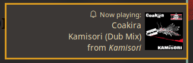

# About application

It uses notify-rust so it should work with any notification daemon
like dunst or KDE/GNOME/XFCE, Windows notifications etc. For album covers it looks
inside a directory that mpd returns as song file directory and it
checks whether cover.png or cover.jpg exists in the directory and uses
it as an icon.  

Example screenshot with dunst:  



Structure of the notification is:  
Summary: Now playing:  
Contents:  
- Artist  
- Title  
- Album  
Icon: Album cover  

# Dependencies

``` toml
[dependencies]
notify-rust = "4"
mpd = "0.0.12"
toml = "0.7.2"
serde = "1.0.152"
dirs = "4.0.0"
```

# Roadmap

- Getting song info
- Getting album cover
  - Improve regex to match any file with cover in name
  - Improve regex to find covers in subfolders (ex. Album has Disc 1 and Disc 2 directories in which covers are located.)
- Sending notifications on song change
    Kinda works? Rewrite needed for status change handling
- Sending notifications on status change (play/pause etc.)
- More configuration file support
- - Support for running as a systemd daemon

# Configuration

By default application will look for your \$HOME/.config directory (or $HOME/AppData/Roaming/ for Windows). It
doesn\'t create it and config file by default. Default fallback config
will be added in future commits.
Default config:

``` toml
music_dir = "/home/moskas/Music/"
ip = "127.0.0.1"
port = "6600"
```

The exact same config file is also located in doc directory.
